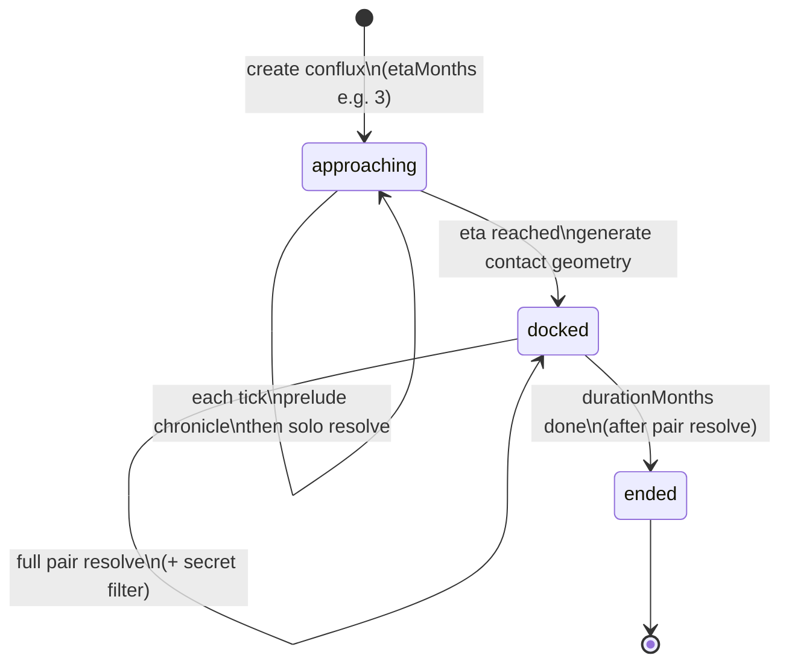

# План Conflux: хроника, факты, резолв

Статус: **MVP + мета-матчмейкинг** (авто 50/50 соло/docked, grace 6 мес, rematch в хронике, ГСЧ ширины прохода). Playtest-harness: [PLAYTEST_AGENT.md](PLAYTEST_AGENT.md).

## Что уже есть

- Лор домена — `domain.lore[]` с тегами `chronicle` / `fact`; опционально `secret` / `secretForDomainId`.
- Тик: `runWorldTick` → **matchmake** → прелюдия/стык → счётчики соло/docked → **pair `resolveConfluxTick`** для `docked` → соло для остальных → advance duration.
- Космология запрещает агентам **придумывать** чужие острова; стыковка — только явный объект мира.
- В `docs/PROJECT.md` § Conflux: временный объект, общий Resolver вместо двух одиночных.

## Принятые решения

1. **Матчмейкинг — только код**, не LLM. Агенты не создают и не закрывают conflux.
2. **Conflux создаётся заранее**, с оценкой момента стыковки (`etaMonths` / `dockAtTick`). Встреча уже неизбежна, но до стыка города ещё **изолированы**.
3. **Две фазы жизни conflux:** `approaching` → `docked` → потом `ended`.
4. **В `approaching`:** полноценный общий резолв пары **не** идёт; города резолвятся соло. Conflux-слой **до** соло дописывает в хронику(и) событие сближения (силуэт/остров ближе, стыковка через N месяцев…).
5. **В момент стыковки (`docked`):** генерируется **`contact`**; далее полный общий резолв пары (`confluxResolver`).
6. **Секретность — просто:** флаг `secret` (+ `secretForDomainId`) на записи хроники. По умолчанию всё публично; `secret` только при явно заказанной тайной операции.
7. **Длительность стыка (фаза docked):** `durationMonths` / `monthsDocked`, затем `ended` **после** pair-resolve тика.
8. **MVP UX:** `POST /api/dev/conflux` + force tick + UI сайдбар.
9. **Контекст пары — симметричный:** равный truncate, одинаковые блоки, shuffle A/B каждый тик; без summarizer-LLM.

## Контекст двух городов (антиbias, MVP)

1. **Сверху — общий кадр:** дата, `contact`, хвост `sharedLore`.
2. **Каждому домену — одинаковый бюджет** (`domainBriefBlock` в `confluxResolve.js`).
3. **Симметричная вёрстка** — два блока `=== DOMAIN id «Имя» ===`.
4. **Shuffle:** случайный порядок A/B каждый тик.
5. **Чеклист pending обоих** в user-prompt + fallbacks в коде.
6. **Промпт-строка:** оба домена равноправны.

## Жизненный цикл



## Поток тика

1. `maybeMatchmakeConfluxes`: пары по дефициту docked-доли (цель `targetDockedFraction`), возраст ≥ `minDomainAgeMonths`, prefer never-met; rematch → тег/фраза в хронике.
2. `processConfluxApproachingPhase`: прелюдия / dock + `contact` (kind — системный ГСЧ по `contactWeights`; LLM только текст).
3. `advanceConfluxLifetimeCounters`: docked-месяц → `confluxMonthsDocked`, иначе (соло + approaching) → `confluxMonthsSolo`.
4. Для каждого `docked`: `resolveConfluxTick` (новости через `filterChronicleForDomain`).
5. Соло для доменов вне docked-пары (включая `approaching`); прелюдия месяца входит в новости.
6. `advanceDockedConfluxes`: `monthsDocked++`; при исчерпании → `ended` + chronicle.

## Секретные записи (фаза `docked`)

| Запись | Куда в лор | Новости месяца |
|--------|------------|----------------|
| без `secret` | оба домена + `sharedLore` | обоим |
| `secret` | только свой домен | только своему |

## Модель данных

**Объект `Conflux`:** `id`, `worldId`, `domainIds`, `type`, `status`, `createdTick`, `etaMonths` / `dockAtTick`, `durationMonths`, `monthsDocked`, `contact`, `sharedLore`, `sharedState`.

## Факты / лормастер

- `approaching`: чужой остров — далёкий; partner brief нет.
- `docked`: `contact` + `sharedLore` + урезанный partner brief; чужие `secret` не отдаются.

## Матчмейкинг

Авто (код, `tick.conflux` в `config/default.yaml`):

- Цель: ~50% времени в `docked`, ~50% соло (**approaching считается соло**).
- Grace: домен младше `minDomainAgeMonths` (6) не матчится.
- Prefer пары, которые ещё не стыковались (`confluxPartners`); rematch помечается в хронике («повторный конфлюкс»).
- `contact.kind`: `hairline` → `bridge` → `gap_jump` → `causeway` → `landmass` (ГСЧ).

Ручной force (dev):

```bash
POST /api/dev/conflux { domainIdA, domainIdB, etaMonths, durationMonths }
GET  /api/confluxes
npm run cli -- conflux --a domain_… --b domain_… --eta 3
```

Код: `src/game/conflux.js`, `src/game/confluxResolve.js`, агент `confluxResolver` в `config/default.yaml`.

## Критерий готовности MVP

- [x] Conflux с ETA: до стыка в хронике обоих есть сближение и «через N месяцев».
- [x] В месяц стыка у обоих есть описание **характера контакта**.
- [x] Dev UI / API создаёт conflux.
- [x] Пока `docked` — один общий резолв; secret фильтруется в новостях и у лормастера.
- [x] Нет третьего выдуманного острова (промпт + космология).
