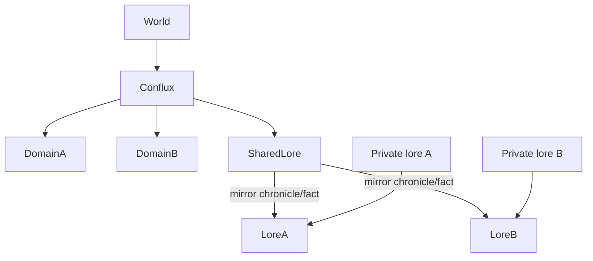

# План Conflux: хроника, факты, резолв

Статус: согласованный дизайн, **ещё не реализован**. Сначала — harness агента-игрока (см. [PLAYTEST_AGENT.md](PLAYTEST_AGENT.md)).

## Что уже есть

- Лор домена — единый массив `domain.lore[]` с тегами: `chronicle` (только Resolver), `fact` (лормастер/генезис). См. `src/game/models.js`, `src/game/tick.js`, `src/game/loremaster.js`.
- Тик сейчас: `runWorldTick` → по одному `resolveDomainTick` на домен → новости правителю.
- Космология уже запрещает агентам **придумывать** чужие острова; стыковка должна приходить только как явный игровой объект.
- В `docs/PROJECT.md` § Conflux: временный объект, общий Resolver вместо двух одиночных.

## Принятые решения

1. **Матчмейкинг — только код**, не LLM. Агенты не создают и не закрывают conflux.
2. **Хроника стыковки пишется в оба домена** (зеркала) + копия в `conflux.sharedLore` как канон пары.
3. **Факты стыковки** — в `sharedLore` с тегом `fact` и зеркалом в оба домена; приватный лор соседа **не** отдаётся чужому лормастеру целиком.
4. **MVP UX:** `POST /api/dev/conflux` + на тике пара резолвится один раз.
5. **Длительность:** `durationMonths` / `monthsDone`, затем `status: ended`.

## Модель данных

**Объект `Conflux`** (напр. `data/confluxes/<id>.yaml`):

- `id`, `worldId`, `domainIds: [A, B]`, `type: 'docking'`
- `startedTick`, `durationMonths`, `monthsDone`, `status: active|ended`
- `sharedLore: []`
- опционально `sharedState.events[]`

**Зеркала в домене:** теги `chronicle|fact`, `conflux`, `conflux:<id>`, `shared`.  
**Асимметрия:** `conflux-private` только в один домен.

## Хроника при Conflux

| Источник | Куда пишет | Теги |
|----------|------------|------|
| Solo Resolver | свой `domain.lore` | `chronicle` |
| Conflux Resolver | `sharedLore` + зеркало A и B | `chronicle`, `conflux`, `shared` |
| Одностороннее | только A или B | `chronicle`, `conflux-private` |

Поток тика: группировка пар → один conflux resolve → соло для остальных.

## Факты при Conflux

- Loremaster в conflux: `sharedLore` + brief партнёра; shared vs private по смыслу вопроса.
- После `ended`: зеркала в доменах остаются; доступ к brief партнёра закрывается.

## Матчмейкинг MVP

Force API/CLI; системная seed-запись стыковки из кода; авто-pair позже.

## Порядок реализации

1. Модель + storage + force create/end + seed chronicle  
2. Тик: conflux resolve + duration/end  
3. Loremaster shared + partner brief  
4. Dev UI/CLI  
5. Smoke: два домена → conflux → tick → общая хроника  

## Критерий готовности MVP

Общие `conflux`-записи в хронике обоих; новости о стыке; факт про соседа из shared; нет третьего выдуманного острова.
