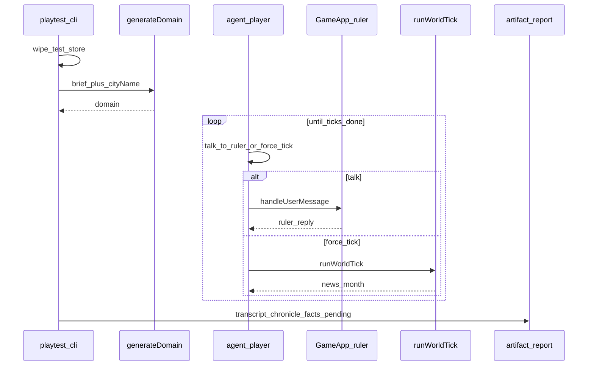

# План: агент-игрок и смоук playtest

Статус: **реализовано** (`npm run playtest`).

Цель: полный LLM-генезис; агент-игрок каждый ход **обязан** `talk_to_ruler`, опционально `force_tick`; ориентир — **майлстоуны** домена. Прогон до N тиков. Новости месяца — вольный пересказ, не дайджест.

Связано: harness удобен и для Conflux ([CONFLUX.md](CONFLUX.md)).

## Зачем

Ручной чат дорогой для регрессий. Нужен CLI-прогон «создали мир → божество действует и само жмёт тик → вот артефакты».

## Принятые решения

1. **Изоляция:** `./data-test` / `--data-dir`.
2. **Полный генезис:** `generateDomain` (не фикстура).
3. **Бриф из YAML** (без чата онбординга в MVP).
4. **Агент `player`:** tools `talk_to_ruler` и `force_tick`. Тик — когда больше нечего говорить правителю.
5. **Конец прогона:** достигнуто `--ticks N` (не фиксированное число реплик).
6. **Ambition + goals** в сценарии — бот должен чего-то добиваться, не болтать.
7. **Отчёт:** `artifacts/playtest-<timestamp>/`.

## Поток



## CLI

```bash
npm run playtest
npm run playtest -- --ticks 5
npm run playtest -- --scripted --ticks 5
```

Опции: `--ticks`, `--max-steps`, `--scenario`, `--scripted`, `--data-dir`, `--out`, `--no-wipe`.

## Сценарий

`scenarios/smoke.yaml`: `cityName`, `playerBrief`, `ambition`, `goals`, опционально `scriptedActions` (`talk` / `tick`).

## Критерий готовности

1. Одна команда: генезис → пока agent сам не наберёт N `force_tick` → артефакты.
2. В отчёте timeline с диалогами и тиками.
3. Живой `data/` не затирается.
